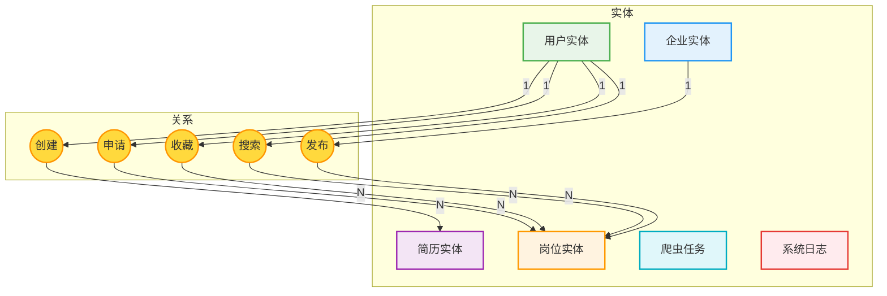
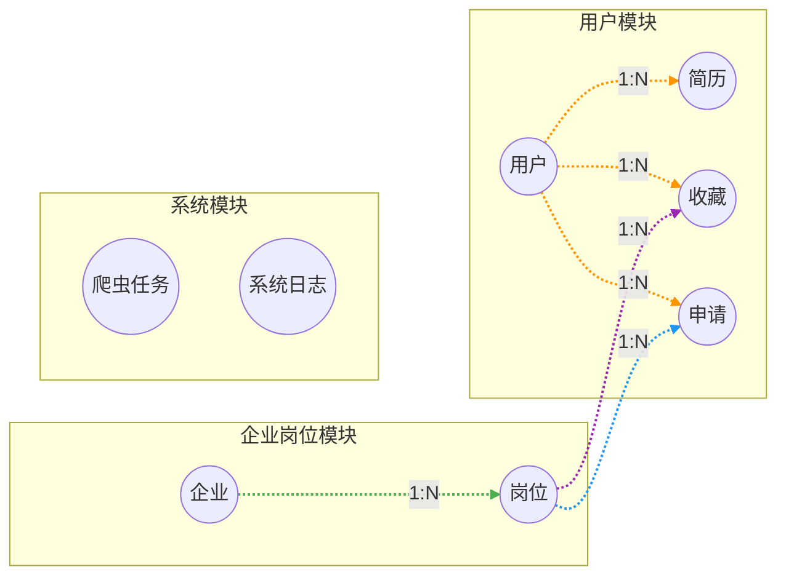

# 招聘数据可视化系统 - E-R图

## 1. 实体关系概述

### 核心实体列表

| 实体 | 表名 | 说明 |
|------|------|------|
| 用户 | `user` | 系统用户（管理员/普通用户） |
| 企业 | `company` | 招聘企业信息 |
| 岗位 | `job` | 招聘岗位信息 |
| 简历 | `resume` | 用户简历信息 |
| 爬虫任务 | `crawl_task` | 爬虫任务配置 |
| 系统日志 | `sys_log` | 操作审计日志 |

### 关系矩阵

| 关系 | 实体1 | 基数 | 实体2 | 基数 | 说明 |
|------|--------|------|--------|------|------|
| 创建简历 | 用户 | 1 | 简历 | N | 一个用户可创建多份简历 |
| 申请岗位 | 用户 | 1 | 岗位申请 | N | 一个用户可申请多个岗位 |
| 收藏岗位 | 用户 | 1 | 岗位收藏 | N | 一个用户可收藏多个岗位 |
| 搜索历史 | 用户 | 1 | 搜索记录 | N | 一个用户可有多个搜索记录 |
| 发布岗位 | 企业 | 1 | 岗位 | N | 一个企业可发布多个岗位 |

---

## 2. E-R图（Mermaid格式）



---

## 3. 完整E-R图（详细版）



---

## 4. 实体属性详细表

### 4.1 用户实体

| 属性 | 类型 | 约束 | 说明 |
|------|------|------|------|
| id | BIGINT | PK, AUTO_INCREMENT | 用户ID |
| username | VARCHAR(50) | NOT NULL, UNIQUE | 用户名 |
| password | VARCHAR(255) | NOT NULL | 密码(SHA-512加密) |
| role | VARCHAR(20) | DEFAULT 'USER' | 角色(ADMIN/USER) |
| email | VARCHAR(100) | - | 电子邮箱 |
| created_at | DATETIME | DEFAULT CURRENT_TIMESTAMP | 创建时间 |

### 4.2 企业实体

| 属性 | 类型 | 约束 | 说明 |
|------|------|------|------|
| id | BIGINT | PK, AUTO_INCREMENT | 企业ID |
| name | VARCHAR(100) | NOT NULL | 企业名称 |
| industry | VARCHAR(100) | - | 所属行业 |
| city | VARCHAR(50) | - | 所在城市 |
| scale | VARCHAR(50) | - | 企业规模 |
| website | VARCHAR(255) | - | 官方网站 |

### 4.3 岗位实体

| 属性 | 类型 | 约束 | 说明 |
|------|------|------|------|
| id | BIGINT | PK, AUTO_INCREMENT | 岗位ID |
| company_id | BIGINT | FK | 关联企业ID |
| title | VARCHAR(100) | NOT NULL | 岗位名称 |
| city | VARCHAR(50) | - | 工作城市 |
| education | VARCHAR(50) | - | 学历要求 |
| experience | VARCHAR(50) | - | 经验要求 |
| min_salary | DECIMAL(10,2) | - | 最低薪资 |
| max_salary | DECIMAL(10,2) | - | 最高薪资 |
| skills | VARCHAR(500) | - | 技能标签 |

### 4.4 简历实体

| 属性 | 类型 | 约束 | 说明 |
|------|------|------|------|
| id | BIGINT | PK, AUTO_INCREMENT | 简历ID |
| user_id | BIGINT | FK, NOT NULL | 关联用户ID |
| name | VARCHAR(50) | - | 姓名 |
| education | VARCHAR(50) | - | 学历 |
| experience_years | INT | - | 工作年限 |
| skills | VARCHAR(500) | - | 技能标签 |
| summary | TEXT | - | 个人简介 |

---

## 5. E-R图符号说明

| 符号 | 形状 | 含义 | 颜色 |
|------|------|------|------|
| 矩形方框 | ▢ | 实体（Entity） | 绿色/蓝色/橙色 |
| 菱形 | ◇ | 关系（Relationship） | 黄色 |
| 椭圆 | ○ | 属性（Attribute） | 白色 |
| 连接线 | ─→ | 关联关系 | 彩色 |
| 基数标注 | 1:N | 一对多关系 | 标注在线上 |

---

## 6. 关系基数说明

### 6.1 一对多关系（1:N）

```
┌──────────┐      1        ┌──────────┐
│  用户    │ ────────────► │  简历    │
└──────────┘      N        └──────────┘
    1个用户可以创建N份简历
```

### 6.2 一对多关系（1:N）

```
┌──────────┐      1        ┌──────────┐
│  企业    │ ────────────► │  岗位    │
└──────────┘      N        └──────────┘
    1个企业可以发布N个岗位
```

### 6.3 多对多关系（N:M）

```
┌──────────┐      N        ┌──────────┐
│  用户    │ ────────────► │  岗位    │
└──────────┘      M        └──────────┘
    N个用户可以申请M个岗位（通过中间表job_application）
```

---

## 7. 数据库表关系图

```
┌──────────────┐     ┌──────────────┐     ┌──────────────┐
│    user      │     │   company    │     │     job      │
│   用户表     │     │   企业表     │     │   岗位表     │
└──────┬───────┘     └──────┬───────┘     └──────┬───────┘
       │                    │                    │
       │ 1:N                │ 1:N                │
       ▼                    ▼                    ▼
┌──────────────┐     ┌──────────────┐     ┌──────────────┐
│   resume     │     │   job        │     │job_application│
│   简历表     │     │   岗位表     │     │  申请表      │
└──────────────┘     └──────────────┘     └──────────────┘
                                              ▲
                                              │
                                              │
                               ┌──────────────┼──────────────┐
                               ▼              ▼              ▼
                         ┌──────────┐  ┌──────────┐  ┌──────────┐
                         │job_favorite│  │search_history│  │crawl_task│
                         │   收藏表   │  │   搜索表     │  │   任务表   │
                         └──────────┘  └──────────┘  └──────────┘
```

---

## 8. SQL DDL代码（用于生成E-R图）

```sql
CREATE TABLE user (
    id BIGINT PRIMARY KEY AUTO_INCREMENT COMMENT '用户ID',
    username VARCHAR(50) NOT NULL UNIQUE COMMENT '用户名',
    password VARCHAR(255) NOT NULL COMMENT '密码',
    role VARCHAR(20) DEFAULT 'USER' COMMENT '角色',
    email VARCHAR(100) COMMENT '邮箱',
    created_at DATETIME DEFAULT CURRENT_TIMESTAMP COMMENT '创建时间'
);

CREATE TABLE company (
    id BIGINT PRIMARY KEY AUTO_INCREMENT COMMENT '企业ID',
    name VARCHAR(100) NOT NULL COMMENT '企业名称',
    industry VARCHAR(100) COMMENT '所属行业',
    city VARCHAR(50) COMMENT '所在城市',
    scale VARCHAR(50) COMMENT '企业规模',
    website VARCHAR(255) COMMENT '官网'
);

CREATE TABLE job (
    id BIGINT PRIMARY KEY AUTO_INCREMENT COMMENT '岗位ID',
    company_id BIGINT COMMENT '企业ID',
    title VARCHAR(100) NOT NULL COMMENT '岗位名称',
    city VARCHAR(50) COMMENT '工作城市',
    education VARCHAR(50) COMMENT '学历要求',
    experience VARCHAR(50) COMMENT '经验要求',
    skills VARCHAR(500) COMMENT '技能标签',
    FOREIGN KEY (company_id) REFERENCES company(id)
);

CREATE TABLE resume (
    id BIGINT PRIMARY KEY AUTO_INCREMENT COMMENT '简历ID',
    user_id BIGINT NOT NULL COMMENT '用户ID',
    name VARCHAR(50) COMMENT '姓名',
    education VARCHAR(50) COMMENT '学历',
    experience_years INT COMMENT '工作年限',
    skills VARCHAR(500) COMMENT '技能',
    FOREIGN KEY (user_id) REFERENCES user(id)
);

CREATE TABLE job_application (
    id BIGINT PRIMARY KEY AUTO_INCREMENT COMMENT '申请ID',
    user_id BIGINT NOT NULL COMMENT '用户ID',
    job_id BIGINT NOT NULL COMMENT '岗位ID',
    FOREIGN KEY (user_id) REFERENCES user(id),
    FOREIGN KEY (job_id) REFERENCES job(id)
);

CREATE TABLE job_favorite (
    id BIGINT PRIMARY KEY AUTO_INCREMENT COMMENT '收藏ID',
    user_id BIGINT NOT NULL COMMENT '用户ID',
    job_id BIGINT NOT NULL COMMENT '岗位ID',
    FOREIGN KEY (user_id) REFERENCES user(id),
    FOREIGN KEY (job_id) REFERENCES job(id)
);

CREATE TABLE crawl_task (
    id BIGINT PRIMARY KEY AUTO_INCREMENT COMMENT '任务ID',
    source_site VARCHAR(100) COMMENT '来源网站',
    keyword VARCHAR(100) COMMENT '关键词',
    status VARCHAR(20) DEFAULT 'PENDING' COMMENT '状态',
    created_at DATETIME DEFAULT CURRENT_TIMESTAMP COMMENT '创建时间'
);

CREATE TABLE sys_log (
    id BIGINT PRIMARY KEY AUTO_INCREMENT COMMENT '日志ID',
    username VARCHAR(50) COMMENT '操作用户',
    action VARCHAR(100) COMMENT '操作名称',
    created_at DATETIME DEFAULT CURRENT_TIMESTAMP COMMENT '时间'
);
```