# 招聘数据可视化系统 — 用例图

> 本文件包含 3 种格式的用例图代码，按需选用：
>
> | 格式 | 用途 | 使用方式 |
> |------|------|----------|
> | **Mermaid** | ✅ 推荐用于论文 | 粘贴到 [mermaid.live](https://mermaid.live) → Download PNG → 插入 Word |
> | **PlantUML** | 备选方案 | 粘贴到 [PlantUML在线编辑器](https://www.plantuml.com/plantuml/uml/) → 导出 PNG |
> | **SVG** | 仅 Markdown 预览 | 不可用于 Word 论文 |

---

## 1. 系统角色定义

| 角色 | 说明 | 权限范围 |
|------|------|----------|
| **管理员** | 系统运维人员 | 全部功能（含爬虫、用户管理、数据管理） |
| **普通用户** | 企业HR人员或求职者 | 认证、岗位浏览收藏、数据分析 |

---

## 2. Mermaid 用例图（推荐 — 用于论文）

> **操作步骤：**
> 1. 复制下方 ```mermaid 和 ``` 之间的全部代码
> 2. 打开 https://mermaid.live
> 3. 左侧代码区清空后粘贴
> 4. 右侧实时预览用例图
> 5. 右上角 Actions → Download PNG（2x 高清）
> 6. 将 PNG 插入 Word 论文，图注写"图X.X 系统用例图"

```mermaid
%% ============================================================
%% 招聘数据可视化系统 — 用例图（Mermaid 语法）
%% ============================================================
%% 图表类型：graph LR（从左到右布局）
%%   - LR = Left to Right，角色在两侧，功能在中间
%%   - 用(("文本")) 表示 UML 用例（椭圆）
%%   - 用(["文本"]) 表示 UML 角色（小人）
%% ============================================================

graph LR

    %% ---- 角色定义 ----
    %% 管理员放在左侧，普通用户放在右侧
    %% 节点形状用(["..."])表示角色（近似小人图标）
    Admin(["👤 管理员\nadmin"])
    User(["👤 普通用户\nHR / 求职者"])

    %% ---- 系统边界 ----
    %% subgraph 相当于 UML 系统边界矩形
    subgraph SYS["🏫 招聘数据可视化系统"]

        %% ---- 分组1：认证管理 ----
        %% 对应后端 AuthController（/api/auth）
        %% 功能：注册、登录、密码修改、个人信息查询
        %% 两个角色共用此模块
        subgraph AUTH["🔐 认证管理"]
            UC1(("注册 / 登录"))
            UC2(("修改密码"))
            UC3(("查看个人信息"))
        end

        %% ---- 分组2：岗位管理 ----
        %% 对应后端 JobController（/api/jobs）
        %% 浏览/搜索/详情/收藏：双角色可用
        %% 发布/编辑/删除：需要 job:write / job:delete 权限（仅管理员）
        subgraph JOB["📋 岗位管理"]
            UC4(("浏览岗位"))
            UC5(("搜索岗位"))
            UC6(("岗位详情"))
            UC7(("收藏岗位"))
            UC8(("发布 / 编辑岗位"))
            UC9(("删除岗位"))
        end

        %% ---- 分组3：数据分析 ----
        %% 对应后端 DataController + AIController + JobController 的统计接口
        %% 包含 ECharts 可视化看板、AI 分析、推荐算法等
        %% 两个角色共用此模块
        subgraph DATA["📊 数据分析"]
            UC10(("数据统计看板"))
            UC11(("岗位趋势分析"))
            UC12(("薪资预测"))
            UC13(("智能岗位推荐"))
            UC14(("AI 分析报告"))
            UC15(("AI 对话咨询"))
        end

        %% ---- 分组4：系统管理（管理员专属）----
        %% 对应后端 CrawlController（爬虫）+ DataController（导入/清理）+ KnowledgeBaseController
        %% 全部需要 ADMIN 角色或特定 Authority 才能访问
        subgraph SYSMGR["⚙️ 系统管理（管理员专属）"]
            UC16(("爬虫配置"))
            UC17(("执行爬虫"))
            UC18(("用户管理"))
            UC19(("数据导入 / 清理"))
            UC20(("知识库管理"))
        end

    end

    %% ============================================================
    %% 连线关系
    %% ============================================================
    %% 管理员 → 功能（左侧指向中间）
    %% 管理员拥有全部 20 个用例的访问权限

    Admin --> UC1
    Admin --> UC2
    Admin --> UC3
    Admin --> UC4
    Admin --> UC5
    Admin --> UC6
    Admin --> UC8
    Admin --> UC9
    Admin --> UC10
    Admin --> UC11
    Admin --> UC12
    Admin --> UC13
    Admin --> UC14
    Admin --> UC15
    Admin --> UC16
    Admin --> UC17
    Admin --> UC18
    Admin --> UC19
    Admin --> UC20

    %% 普通用户 → 功能（右侧指向中间）
    %% Mermaid 不支持 <-- 语法，必须用 User --> 写法
    %% 普通用户不能访问：发布/编辑岗位(UC8)、删除岗位(UC9)、
    %%                   爬虫配置(UC16)、执行爬虫(UC17)、
    %%                   用户管理(UC18)、数据导入清理(UC19)、知识库管理(UC20)

    User --> UC1
    User --> UC2
    User --> UC3
    User --> UC4
    User --> UC5
    User --> UC6
    User --> UC7
    User --> UC10
    User --> UC11
    User --> UC12
    User --> UC13
    User --> UC14
    User --> UC15

    %% ---- 样式定义 ----
    %% 管理员角色：紫色系（对应系统中 ADMIN 角色的紫色调）
    style Admin fill:#EEEDFE,stroke:#534AB7,stroke-width:2px,color:#3C3489
    %% 普通用户角色：绿色系
    style User fill:#EAF3DE,stroke:#3B6D11,stroke-width:2px,color:#27500A

    %% 认证管理分组：蓝色系
    style AUTH fill:#E6F1FB,stroke:#378ADD,stroke-width:1px,color:#185FA5
    style UC1 fill:#E6F1FB,stroke:#378ADD,stroke-width:1px,color:#0C447C
    style UC2 fill:#E6F1FB,stroke:#378ADD,stroke-width:1px,color:#0C447C
    style UC3 fill:#E6F1FB,stroke:#378ADD,stroke-width:1px,color:#0C447C

    %% 岗位管理分组：绿色系
    style JOB fill:#EAF3DE,stroke:#639922,stroke-width:1px,color:#3B6D11
    style UC4 fill:#EAF3DE,stroke:#639922,stroke-width:1px,color:#27500A
    style UC5 fill:#EAF3DE,stroke:#639922,stroke-width:1px,color:#27500A
    style UC6 fill:#EAF3DE,stroke:#639922,stroke-width:1px,color:#27500A
    style UC7 fill:#EAF3DE,stroke:#639922,stroke-width:1px,color:#27500A
    style UC8 fill:#F4C0D1,stroke:#993556,stroke-width:1px,color:#4B1528
    style UC9 fill:#F4C0D1,stroke:#993556,stroke-width:1px,color:#4B1528

    %% 数据分析分组：琥珀色系
    style DATA fill:#FAEEDA,stroke:#BA7517,stroke-width:1px,color:#854F0B
    style UC10 fill:#FAEEDA,stroke:#BA7517,stroke-width:1px,color:#633806
    style UC11 fill:#FAEEDA,stroke:#BA7517,stroke-width:1px,color:#633806
    style UC12 fill:#FAEEDA,stroke:#BA7517,stroke-width:1px,color:#633806
    style UC13 fill:#FAEEDA,stroke:#BA7517,stroke-width:1px,color:#633806
    style UC14 fill:#FAEEDA,stroke:#BA7517,stroke-width:1px,color:#633806
    style UC15 fill:#FAEEDA,stroke:#BA7517,stroke-width:1px,color:#633806

    %% 系统管理分组：粉色系（管理员专属，与普通用户可用功能区分）
    style SYSMGR fill:#F4C0D1,stroke:#993556,stroke-width:1px,color:#4B1528
    style UC16 fill:#F4C0D1,stroke:#993556,stroke-width:1px,color:#4B1528
    style UC17 fill:#F4C0D1,stroke:#993556,stroke-width:1px,color:#4B1528
    style UC18 fill:#F4C0D1,stroke:#993556,stroke-width:1px,color:#4B1528
    style UC19 fill:#F4C0D1,stroke:#993556,stroke-width:1px,color:#4B1528
    style UC20 fill:#F4C0D1,stroke:#993556,stroke-width:1px,color:#4B1528

    %% 系统边界外框
    style SYS fill:none,stroke:#378ADD,stroke-width:2px
```



---

## 3. PlantUML 用例图（备选方案）

> 如果 Mermaid 渲染效果不满意，可用 PlantUML 作为备选。
> 操作：粘贴到 https://www.plantuml.com/plantuml/uml/ → 导出 PNG

```plantuml
@startuml
%% ============================================================
%% 招聘数据可视化系统 — 用例图（PlantUML 语法）
%% ============================================================
%% PlantUML 原生支持 UML 用例图语法
%%   - actor  = 角色（小人图标）
%%   - usecase = 用例（椭圆）
%%   - package = 分组（矩形框）
%%   - rectangle = 系统边界
%%   - left to right direction = 从左到右布局
%% ============================================================

%% ---- 全局样式 ----
skinparam usecase {
  BackgroundColor #EEF4FF       %% 用例背景色：浅蓝
  BorderColor #4A6FA5           %% 用例边框色：蓝灰
  ArrowColor #4A6FA5            %% 箭头颜色
  ActorBorderColor #534AB7      %% 角色边框色：紫色
  ActorBackgroundColor #EEEDFE  %% 角色背景色：浅紫
  ActorFontSize 14              %% 角色字号
}
skinparam rectangle {
  BackgroundColor #F5F9FF       %% 系统边界背景
  BorderColor #378ADD           %% 系统边界边框
  BorderThickness 1.5           %% 边框粗细
  RoundCorner 12                %% 圆角
}
skinparam package {
  BackgroundColor #F5F9FF       %% 分组背景
  BorderColor #AAAAAA           %% 分组边框
  RoundCorner 8                 %% 圆角
}

%% ---- 布局方向：左到右（角色分列两侧）----
left to right direction

%% ---- 角色定义 ----
actor "管理员\nadmin" as Admin #EEEDFE
actor "普通用户\nHR/求职者" as User #EAF3DE

%% ---- 系统边界 ----
rectangle "招聘数据可视化系统" {

  %% ---- 分组1：认证管理 ----
  %% 对应 AuthController（/api/auth）
  %% 接口：POST /login, POST /register, POST /change-password, GET /user-info
  package "认证管理" {
    usecase "注册 / 登录" as UC_Login
    usecase "修改密码" as UC_Pwd
    usecase "查看个人信息" as UC_Profile
  }

  %% ---- 分组2：岗位管理 ----
  %% 对应 JobController（/api/jobs）
  %% 公开接口：GET /{id}, POST /page, GET /stat/*, GET /recommend
  %% 管理员接口：POST（发布）, PUT（编辑）, DELETE（删除）
  package "岗位管理" {
    usecase "浏览岗位" as UC_Browse
    usecase "搜索岗位" as UC_Search
    usecase "岗位详情" as UC_Detail
    usecase "收藏岗位" as UC_Collect
    usecase "发布 / 编辑岗位\n[需 job:write 权限]" as UC_Publish
    usecase "删除岗位\n[需 job:delete 权限]" as UC_Delete
  }

  %% ---- 分组3：数据分析 ----
  %% 对应 DataController + AIController + JobController 统计接口
  %% 包含：ECharts 可视化、AI 分析（/api/ai/chat, /api/ai/stream）、
  %%       薪资预测（/api/jobs/predict-salary）、推荐（/api/jobs/recommend）
  package "数据分析" {
    usecase "数据统计看板" as UC_Dashboard
    usecase "岗位趋势分析" as UC_Trend
    usecase "薪资预测" as UC_Salary
    usecase "智能岗位推荐" as UC_Recommend
    usecase "AI 分析报告" as UC_AIReport
    usecase "AI 对话咨询" as UC_AIChat
    usecase "数据对比" as UC_Compare
  }

  %% ---- 分组4：系统管理（管理员专属）----
  %% 对应 CrawlController + DataController + KnowledgeBaseController
  %% 所有接口都加了 @PreAuthorize 权限校验
  package "系统管理\n（管理员专属）" {
    usecase "爬虫配置\n[需 crawl:manage 权限]" as UC_CrawlCfg
    usecase "执行爬虫\n[需 crawl:manage 权限]" as UC_CrawlRun
    usecase "用户管理" as UC_UserMgr
    usecase "数据导入\n[需 data:import 权限]" as UC_Import
    usecase "数据清理\n[需 data:cleanup 权限]" as UC_Clean
    usecase "知识库管理" as UC_KB
  }
}

%% ============================================================
%% 连线关系
%% ============================================================

%% ---- 管理员连线（左侧 → 功能）----
%% 管理员可访问全部 20 个用例
Admin --> UC_Login
Admin --> UC_Pwd
Admin --> UC_Profile
Admin --> UC_Browse
Admin --> UC_Search
Admin --> UC_Detail
Admin --> UC_Publish
Admin --> UC_Delete
Admin --> UC_Dashboard
Admin --> UC_Trend
Admin --> UC_Salary
Admin --> UC_Recommend
Admin --> UC_AIReport
Admin --> UC_AIChat
Admin --> UC_Compare
Admin --> UC_CrawlCfg
Admin --> UC_CrawlRun
Admin --> UC_UserMgr
Admin --> UC_Import
Admin --> UC_Clean
Admin --> UC_KB

%% ---- 普通用户连线（功能 ← 右侧）----
%% 普通用户只能访问 13 个非管理类用例
%% 排除：发布/编辑岗位、删除岗位、爬虫配置/执行、用户管理、数据导入/清理、知识库管理
UC_Login <-- User
UC_Pwd <-- User
UC_Profile <-- User
UC_Browse <-- User
UC_Search <-- User
UC_Detail <-- User
UC_Collect <-- User
UC_Dashboard <-- User
UC_Trend <-- User
UC_Salary <-- User
UC_Recommend <-- User
UC_AIReport <-- User
UC_AIChat <-- User
UC_Compare <-- User

@enduml
```

---

## 4. 用例清单

### 认证管理（双角色共用）
| 用例 | 管理员 | 普通用户 | 后端接口 |
|------|--------|----------|----------|
| 注册 / 登录 | ✅ | ✅ | POST /api/auth/login, /register |
| 修改密码 | ✅ | ✅ | POST /api/auth/change-password |
| 查看个人信息 | ✅ | ✅ | GET /api/auth/user-info |

### 岗位管理
| 用例 | 管理员 | 普通用户 | 后端接口 |
|------|--------|----------|----------|
| 浏览岗位 | ✅ | ✅ | POST /api/jobs/page |
| 搜索岗位 | ✅ | ✅ | POST /api/jobs/page（带筛选条件） |
| 岗位详情 | ✅ | ✅ | GET /api/jobs/{id} |
| 收藏岗位 | ❌ | ✅ | 前端本地收藏逻辑 |
| 发布/编辑岗位 | ✅（job:write） | ❌ | POST / PUT /api/jobs |
| 删除岗位 | ✅（job:delete） | ❌ | DELETE /api/jobs/{id} |

### 数据分析（双角色共用）
| 用例 | 管理员 | 普通用户 | 后端接口 |
|------|--------|----------|----------|
| 数据统计看板 | ✅ | ✅ | GET /api/jobs/stat/* |
| 岗位趋势分析 | ✅ | ✅ | GET /api/jobs/stat/* |
| 薪资预测 | ✅ | ✅ | GET /api/jobs/predict-salary |
| 智能岗位推荐 | ✅ | ✅ | GET /api/jobs/recommend |
| AI 分析报告 | ✅ | ✅ | POST /api/jobs/ai-analysis |
| AI 对话咨询 | ✅ | ✅ | POST /api/ai/chat, /stream |
| 数据对比 | ✅ | ✅ | GET /api/data/export + 前端对比 |

### 系统管理（仅管理员）
| 用例 | 管理员 | 普通用户 | 后端接口 |
|------|--------|----------|----------|
| 爬虫配置 | ✅（crawl:manage） | ❌ | POST /api/crawl/task |
| 执行爬虫 | ✅（crawl:manage） | ❌ | POST /api/crawl/task/{id}/start |
| 用户管理 | ✅ | ❌ | 管理员后台操作 |
| 数据导入 | ✅（data:import） | ❌ | POST /api/data/import |
| 数据清理 | ✅（data:cleanup） | ❌ | POST /api/data/cleanup |
| 知识库管理 | ✅ | ❌ | /api/knowledge/* |

---

## 5. 权限说明

基于 **JWT + Spring Security**，通过 `@PreAuthorize` 注解控制接口访问权限：

| 权限标识 | 含义 | 对应用例 |
|----------|------|----------|
| `hasRole('ADMIN')` | 管理员角色 | 所有管理员专属功能 |
| `hasAuthority('crawl:manage')` | 爬虫管理权限 | 爬虫配置、执行爬虫 |
| `hasAuthority('job:write')` | 岗位写入权限 | 发布/编辑岗位 |
| `hasAuthority('job:delete')` | 岗位删除权限 | 删除岗位 |
| `hasAuthority('data:import')` | 数据导入权限 | 数据导入 |
| `hasAuthority('data:cleanup')` | 数据清理权限 | 数据清理 |

> 无 `@PreAuthorize` 注解的接口默认对所有已登录用户开放（如统计查询、AI 对话等）。

---

## 6. 图例说明（供论文参考）

| 元素 | 含义 | 颜色 |
|------|------|------|
| 👤 小人图标 | UML 参与者（Actor） | 管理员紫 / 用户绿 |
| 椭圆 | UML 用例（Use Case） | 按分组着色 |
| 矩形 | UML 系统边界（System Boundary） | 蓝色边框 |
| 实线箭头 | 参与者与用例的关联关系 | 灰蓝色 |
| 蓝色椭圆 | 认证管理类用例 | #E6F1FB |
| 绿色椭圆 | 岗位管理类用例（双角色可用） | #EAF3DE |
| 粉色椭圆 | 管理员专属用例 | #F4C0D1 |
| 琥珀色椭圆 | 数据分析类用例 | #FAEEDA |
